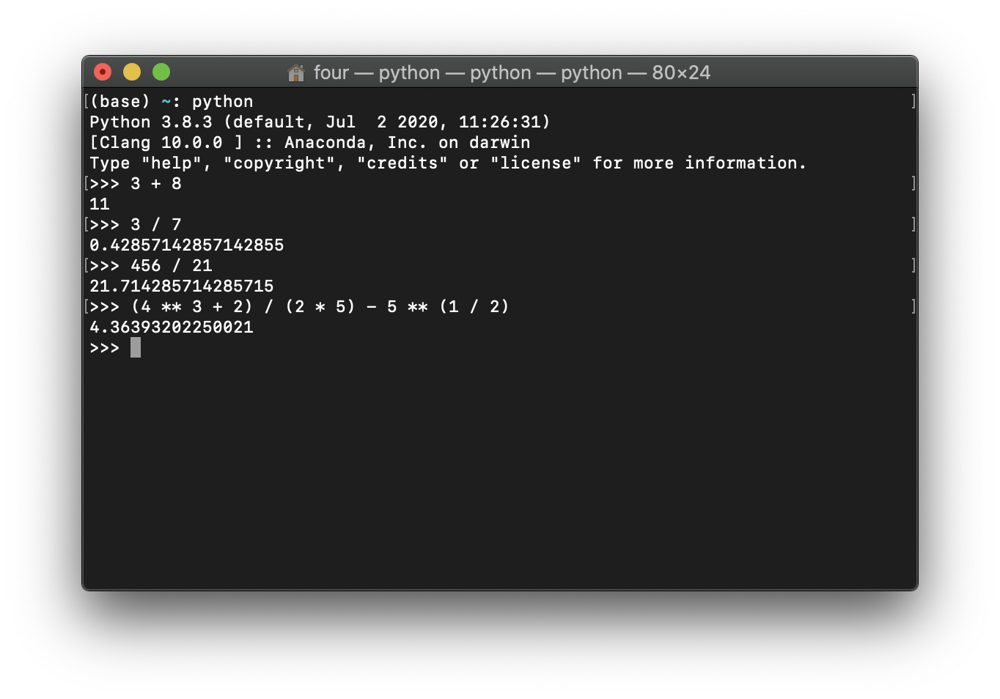
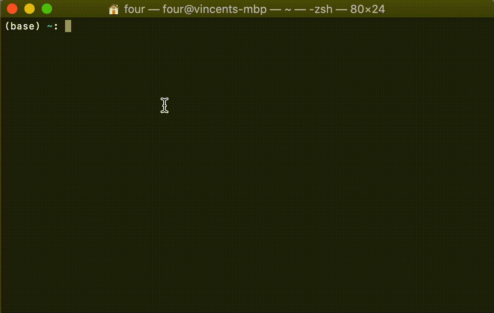
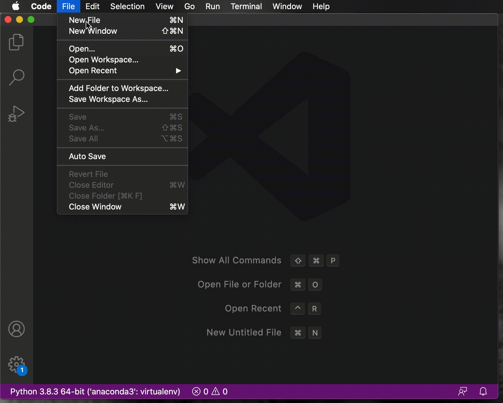
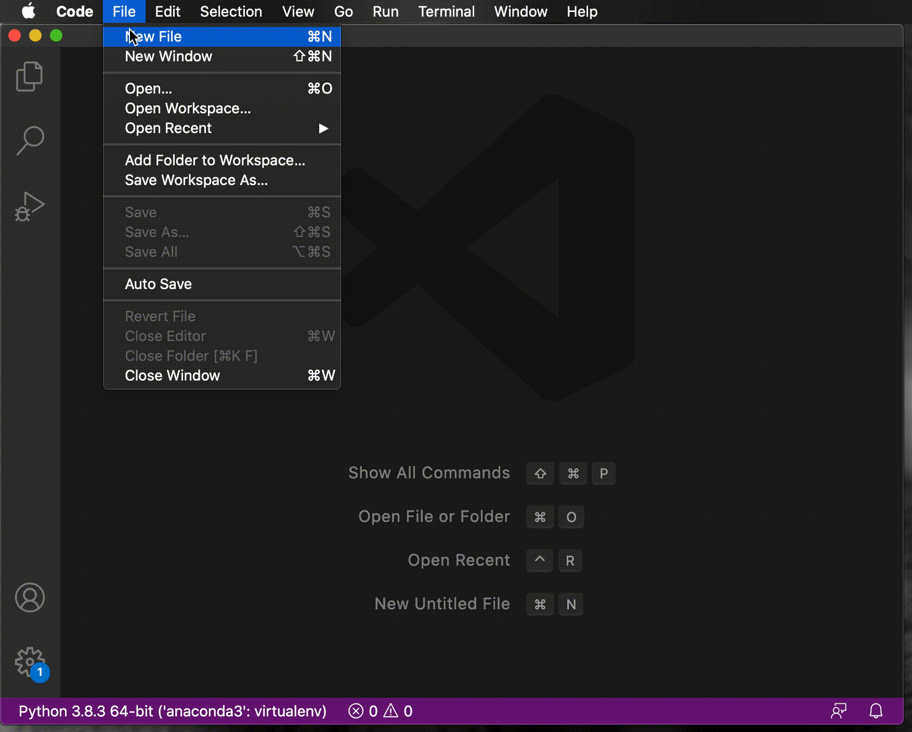

---
jupytext:
  formats: ipynb,md:myst
  text_representation:
    extension: .md
    format_name: myst
    format_version: 0.12
    jupytext_version: 1.6.0
kernelspec:
  display_name: Python 3
  language: python
  name: python3
---

# Solutions

## Question 1

> `1`. Use the REPL (read eval print loop) to carry out the following calculations:

> `1`. $3 + 8$

> `2`. $3 / 7$

> `3`. $456 / 21$

> `4`. $\frac{4 ^ 3 + 2}{2\times 5} - 5 ^ {\frac{1}{2}}$




Click the toggle ("Click to Show") to see a demo of this:

```{toggle}

```

## Question 2

> `2`.. Install the Python plugin for VScode.

The [How to install VScode plugins section](how_to_install_a_vscode_plugin)
describes how to do this and includes an animation with a demonstration.

## Question 3

> `3`. Use the command line and a python script written in VScode to solve the
   following problems:

> `1`. Find the solutions to the following equation: $x ^ 2 - 3 x + 2 = 1$.

The code to do this:

```{code-cell} ipython3
import sympy as sym

x = sym.Symbol("x")
equation = sym.Eq(x ** 2 - 3 * x + 2, 1)
print(sym.solveset(equation))
```

Click the toggle ("Click to Show") to see a demo running this:

```{toggle}

```


> `2`. Differentiate the following function: $f(x) = \cos(x) / 4$

```{code-cell} ipython3
import sympy as sym

x = sym.Symbol("x")
f = sym.cos(x) / 4
print(sym.diff(f, x))
```

Click the toggle ("Click to Show") to see a demo running this:

```{toggle}

```

> `3`. Find the determinant of $A = \begin{pmatrix} 1 / 5 & 1\\1 & 1\end{pmatrix}$.

```{code-cell} ipython3
import sympy as sym

A = sym.Matrix([[sym.S(1) / 5, 1], [1, 1]])
print(sym.det(A))
```

Click the toggle ("Click to Show") to see a demo running this:

```{toggle}

```


> `4`. Count the number of ways of picking 2 letters from "ABCD" where order
      does not matter.

```{code-cell} ipython3
import itertools

combinations = tuple(itertools.combinations("ABCD", r=2))
print(len(combinations))
```

Click the toggle ("Click to Show") to see a demo running this:

```{toggle}

```

> `5`. Simulate the probability of picking a red token from a bag with 3 red
      rokens, 5 blue tokens and a yellow token.

```{code-cell} ipython3
import random


def pick_token():
    """
    Pick a token from a bag with 3 red and 5 blue and a yellow
    """
    bag = ["Red"] * 3 + ["Blue"] * 5 + ["Yellow"]
    return random.choice(bag)


number_of_repetitions = 10000
random.seed(0)
selections_with_red = [pick_token() == "Red" for repetition in range(number_of_repetitions)]
print(sum(selections_with_red) / number_of_repetitions)
```

Click the toggle ("Click to Show") to see a demo running this:

```{toggle}

```

> `6`. Obtain the first 5 terms of the sequence defined by:

> $$
        \left\{
            \begin{array}
              a_0 = 0,\\
              a_1 = 2,\\
              a_n = 3 a_{n - 1} + a_{n - 2}, n \geq 2
            \end{array}
        \right.
      $$

```{code-cell} ipython3
def get_sequence(n):
    """
    Use recursion to obtain the nth term of the sequence a.
    """
    if n == 0:
        return 0
    if n == 1:
        return 2
    return 3 * get_sequence(n - 1) + get_sequence(n - 2)


for n in range(5):
    print(get_sequence(n=n))
```

Click the toggle ("Click to Show") to see a demo running this:

```{toggle}

```

## Question 4

> `4`. Install the `Markdown all in one` plugin for markdown in VScode and then:

>  `1`. Create a new file `main.md`.

>  `2`. Write some basic markdown in it.

>  `3`. Use the plugin to preview the rendered markdown.

- Go to `Code > Preferences > Extensions`.
- Search for `Markdown` and click `Install` on `Markdown all in one`.
- Create a new file, write some markdown and click on save to save it as
  `main.md`
- Click on the `Open Preview to the Side` icon in the top right.

Click the toggle ("Click to Show") to see a demo of this:

```{toggle}

```
