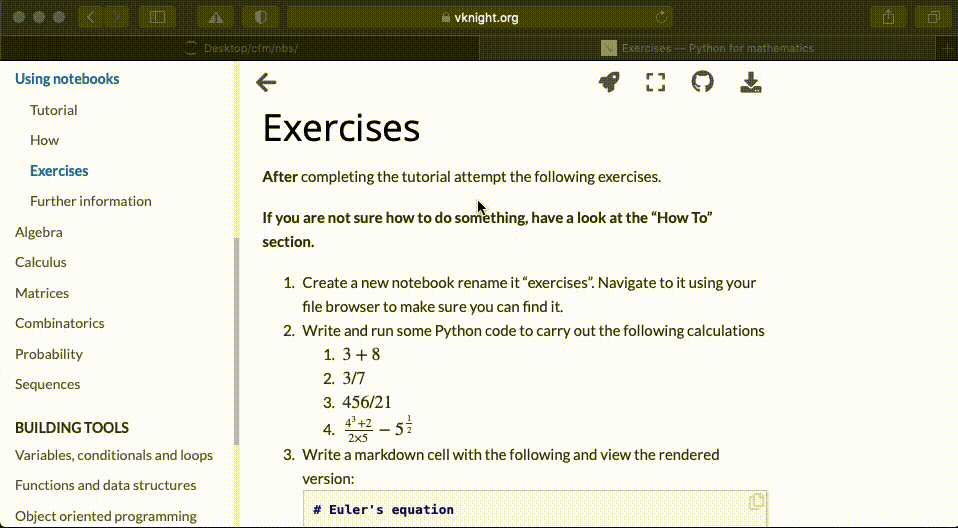
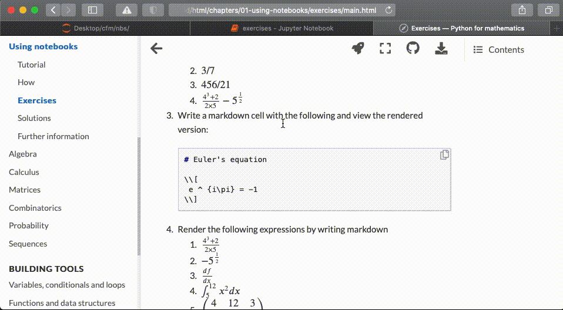
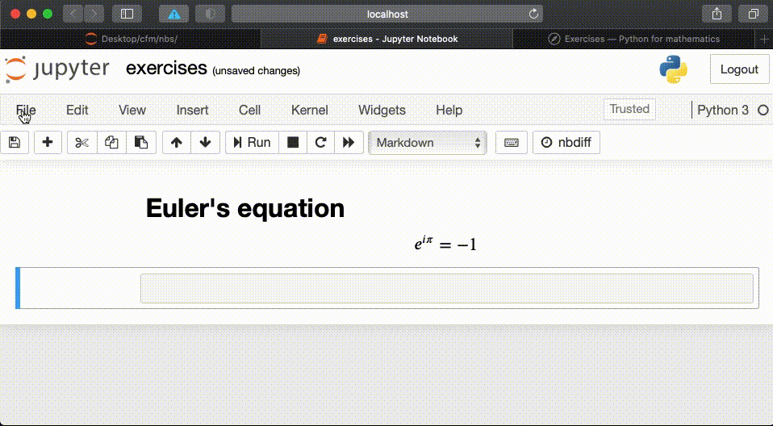

---
jupytext:
  formats: ipynb,md:myst
  text_representation:
    extension: .md
    format_name: myst
    format_version: 0.12
    jupytext_version: 1.6.0
kernelspec:
  display_name: Python 3
  language: python
  name: python3
---

# Solutions

## Question 1

> `1`. Create a new notebook rename it "exercises". Navigate to it using your
> file browser to make sure you can find it.

Click the toggle ("Click to Show") to see a demo of this:

```{toggle}

```

## Question 2

> `2`. Write and run some Python code to carry out the following calculations

> `1`. $3 + 8$

```{code-cell} ipython 3
:tags: [nbval-ignore-output]

3 + 8
```

> `2`. $3 / 7$

```{code-cell} ipython3
:tags: [nbval-ignore-output]

3 / 7
```

> `3`. $456 / 21$

```{code-cell} ipython3
:tags: [nbval-ignore-output]

456 / 21
```

> `4`. $\frac{4 ^ 3 + 2}{2\times 5} - 5 ^ {\frac{1}{2}}$

```{code-cell} ipython3
:tags: [nbval-ignore-output]

(4 ** 3 + 2) / (2 * 5) - 5 ** (1 / 2)
```

## Question 3

> 3. Write a markdown cell with the following and view the rendered version:

```md
# Euler's equation

$$
e ^ {i\pi} = -1
$$
```

Click the toggle ("Click to Show") to see a demo of this:

```{toggle}

```

## Question 4

> `4`. Render the following expressions by writing markdown

> `1`. $\frac{4 ^ 3 + 2}{2\times 5}$

```
$\frac{4 ^ 3 + 2}{2\times 5}$
```

> `2`. $- 5 ^ {\frac{1}{2}}$

```
$- 5 ^ {\frac{1}{2}}$
```

> `3`. $\frac{df}{dx}$

```
$\frac{df}{dx}$
```

> `4`. $\int_{5}^{12}x^2dx$

```
$\int_{5}^{12}x^2dx$
```

> `5`. $\begin{pmatrix}4 & 12 & 3\\2 & x & i\\\end{pmatrix}$

```md
$\begin{pmatrix}4 & 12 & 3\\2 & x & i\\\end{pmatrix}$
```

## Question 5

> `5`. Save your notebook to `HTML` and open and view it.

Click the toggle ("Click to Show") to see a demo of this:

```{toggle}

```

## Question 6

> `6`. Download the notebook available at
  [10.5281/zenodo.7118738](https://zenodo.org/record/7118738/files/demo.ipynb?download=1) and
  check that you are able to open it.

Click the toggle ("Click to Show") to see a demo of this:

```{toggle}

```
